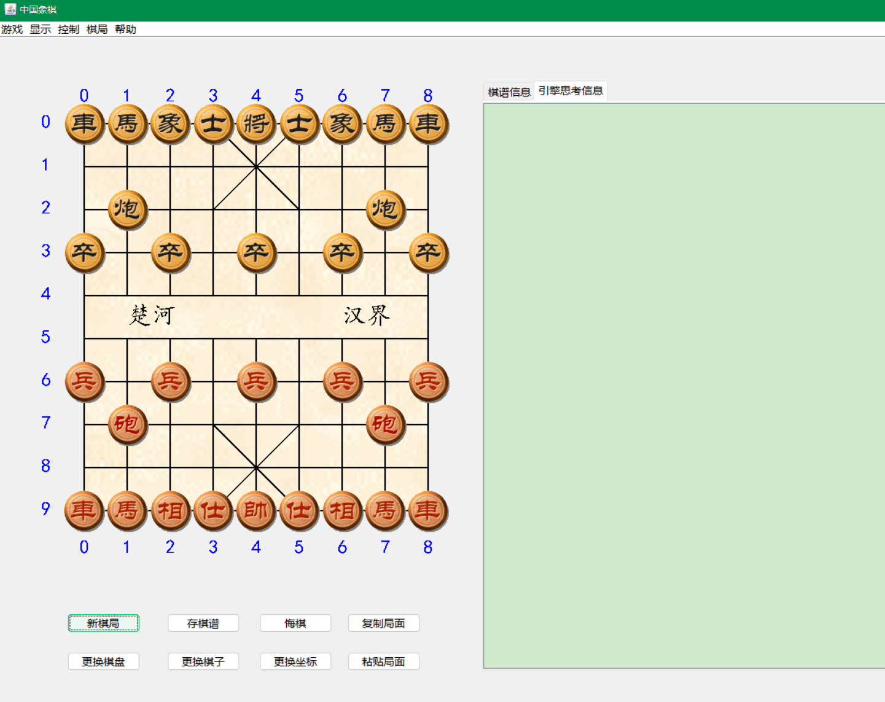

# UcciChineseChess

#### 介绍
### Java程序实现的UCCI引擎的界面程序 

Java版中国象棋游戏。通过调用UCCI引擎实现，界面如下： 

#### 说明
本程序使用Java Swing开发，开发状况如下： 
已实现功能： 
1、象棋棋子走棋规则； 
2、本地UCCI引擎的调用与结果读取； 
3、人机对战； 
4、棋谱记录； 
5、UCCI引擎输出信息日志记录； 
 
未实现功能： 
1、最终输赢判断， 
2、走棋时将军判断； 
3、长将与长拦判断； 
4、菜单和界面按钮的功能； 
  

本人精力有限，故将代码开源出来，希望有人能继续开发下去。

